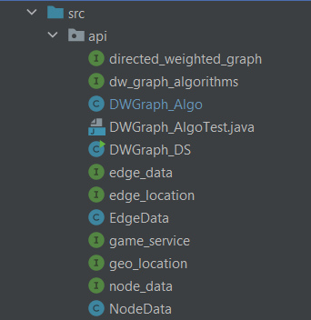
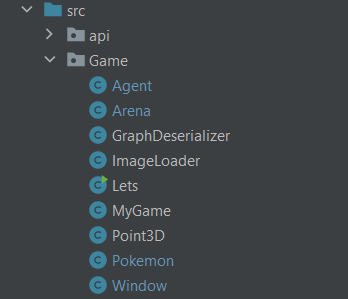

#Pokemons Game - A Two Part OOP Project

**Authors: David Kokiashvilli & Dor Yaakobi**

## Introduction
**This repository is a part of several exercises in OOP course, this assignment was separated to two parts. First part being the implementation of various interfaces to create an 
Object to represent a Directed Weighted Graph (definition of a directed graph: https://en.wikipedia.org/wiki/Directed_graph )
Second part of the exercise is a simulation of a Pokemons Game where the methods and algorithms that were implemented in the first part are being used as few more classes for a simple user GUI to insert two parameters ID and Level to start the game.**

**Click [Here](https://github.com/DKO0506/Ex2/archive/master.zip) to download this project.Instruction on how to run the game are listed below.**

***
  #Project pakages and classes:
  ###Pakage: src/api

Class | Interface                   
------------ | -------------                    
NodeData | node_data
EdgeData | edge_data
DWGrph_DS | dw_graph_ds
DWGraph_Algo | dw_graph_algo

- NodeData: Implements the node_data interface methods and its characteristics.
  

- EdgeData: This class implements the edge_data interface methods and its characteristics. 

- DWGraph_DS: Implements the dw_graph_ds interface to create a directed weighted graph structure. 

- DWGraph_Algo: Implements the dw_graph_algo interface for the different methods and algorithms that would be manipulated on the DWGraph_DS.

The DWGraph_Algo class uses different algorithms from Graph-Theory to explore the graph. The two major algorithms are
"Dijkstra's Algorithm" and "BFS" (also known as Breadth-first search).

|`isConnected` : This method uses the BFS algorithm to explore the graph starting from an arbitrary node in the graph 
and spreading throught the graph by layers, the method uses three other methods to transpose the graph and then checking it from an opposite direction.
[Video to illustrate BFS](https://www.youtube.com/watch?v=oDqjPvD54Ss&ab_channel=WilliamFiset)

|`shortestPath` : This method uses Dijkstra algorithm to find the shortest path from two given nodes in the graph. The algorithm can be simplified 
by these steps: 
1. Set the distance for the current node to 0 (its own weight rather than its edges weight).
2. Set all distances (in this case the weight of the edge to infinty) for each node in the graph.
3. Visit all of the current node neighbors with the smallest known distance.
4. If the current known distance is smaller thanthe last known distance update the distance to the current distance.
5. Update the previous node for each of the updated distances
6. Add the current node to the list of visited nodes
7. Repeat all previous steps until all nodes are marked as visited.
  
   [Dijkstra algorithm](https://www.youtube.com/watch?v=pVfj6mxhdMw&t=193s&ab_channel=ComputerScience)

In order the speed up the process of finding the shortest path the algorithm uses a `PriorityQueue` data structure, comparing between the 
calculated routes paths in order to reach the destination node in less steps as possible.

###Pakage: src/Game

Class | How it's implemented
------------ | -------------                    
GraphDeserializer |  implements JsonDeserializer
ImageLoader | extends JPanel 
MyGame | implements Runnable
Point3D | implements geo_location and Serializable
Window | extends JFrame

- **Agent:** This class creates an Object to represent the "coaches" in the game platform which tracks the Pokemons and catch them. 
  Each Agent is constructed by several characteristics such as the source point (where he is deployed in the graph),its ID,speed and value.
  

- **Pokemon:** This class represent the objectives of the game, each Pokemon holds the information regarding the general position it is located, 
  and the relative location on an edge in the graph as well as its value.

  
- **Arena:** Represents the full field ground for a multi Agents and Pokemons scenario. While the game is being conducted the arena changes with every move/capturing of a Pokémon
due to the algorithms that are applied on the Agents and the Pokemons.
  
Both Agent and Pokemon classes use a |`Point3D` object to demonstrate a 3D location in the graph. That class implements the`geo_location` interface
  
- **Window/ImageLoader:** These classes are used for a basic GUI. 

****

## The Pokemon Game

**The game occurs in different levels from [0-23] in which the amount of available Agents and Pokemons differs, in order to catch the Pokemons the agent must 
be in proximity with the Pokémon (`type` field for the Pokémon indicates the Pokémon is on the edge going from a low id of node to a higher one "1" and vice versa "-1").
The Agents move on the graph with every call to the method `move()` which receive information from the server in a Json format which is then translated to the new location of each agent.
Each level has a time cap and the main goal is to catch Pokemons as many as possible before the time ends, when the agent catches a pokemon its value increases
and when the level ends the score is calculated with all of the agents values that were in the level.
When a level begins there might be more available pokemns than Agents therefore the deployment of the agents in the key locations close as possible to the pokemons will draw a better overall score in each level.**

[comment]: <> (###How To Run The Game:)

[comment]: <> (Once you have downloaded the project repository run the cmd inside the folder where you located the project and use the command |`java -jar Ex2.jar id level`,)

[comment]: <> (the game will start running with the two arguments inserted for `id` and `level`.)

[comment]: <> (![alt-text]&#40;&#41;)

[comment]: <> (###Game Screenshots)

[comment]: <> ( - When the game starts this window will pop asking for the user credentials `id` and `level` to initiate.)

[comment]: <> (![alt-text]&#40;Pics/userLog.png&#41; )

[comment]: <> (![alt-text]&#40;&#41;)

[comment]: <> (![alt-text]&#40;&#41;)

[comment]: <> (**Our Scores for different levels:**)

[comment]: <> (Level | Score | Moves )

[comment]: <> (------|-------|------)

[comment]: <> (1 | 437|363)

[comment]: <> (5 | |)

[comment]: <> (8 | |)

[comment]: <> (10| |)

[comment]: <> (15| |)

[comment]: <> (23| |)

